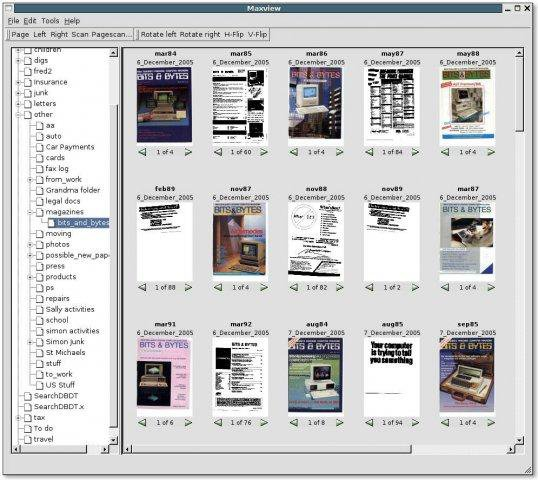
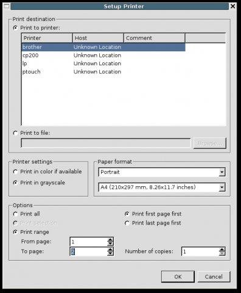
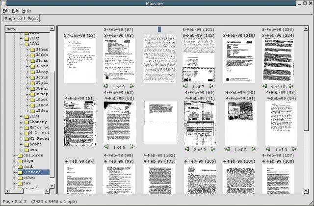
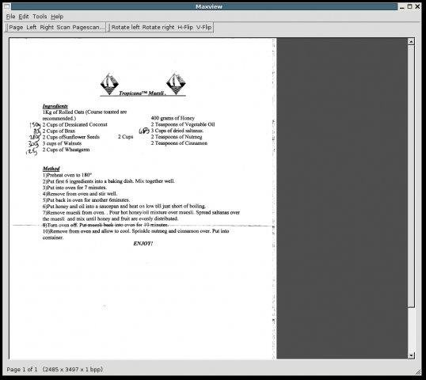
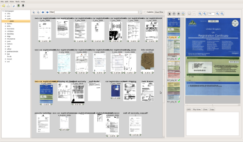
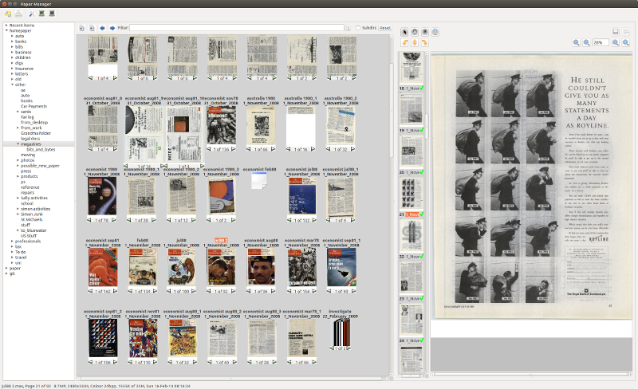

# Paper Manager

This program provides a viewer for image files such as pdf, jpeg and
its own variant of PaperPort's .max file format.

See the INSTALL file for installation instructions.

Desktop view | Select scanner | Dated files | Open file | Preview | Preview2
------------ | -------------- | ----------- | --------- | ------- | --------
 |  |  |  |  | 

## Features

- simple GUI based around stacks and pages
- view previews and browse through pages
- move pages in and out of stacks
- navigate through directories
- move stacks between directories
- double click to view full size page image (also on right pane)
- print stacks and pages, including page annotations
- full undo/redo

new in 0.4:
- basic scanning
- partial creation of .max files (but monochrome images are uncompressed)
       (also it doesn't create greyscale/colour previews)

new in 0.5:
- better scanning, should now work properly with SANE and most scanners
- stacking/unstacking, moving files between directories, etc.
- colour previews are created (greyscale still not sorry)
- PDF, JPEG and TIFF conversion supported. Results may vary
- View quality menu to trade speed for quality

new in 0.7:
- better multithreaded scanning
- undo/redo
- better PDF support
- preview panes
- OCR engine
- zooming in and out in preview windows (hold down control and use
     mouse wheel)
- rewritten for QT4
- many many other changes and improvements

new in 0.7.1:
- a few bug fixes

new in 0.8
- first github release
- new icon
- cleaned up README

new in 1.0
- fully ported to QT4
- should build on very modern distributions that don't have QT3

new in 1.0.1
- builds with QT5, including on Ubuntu 20.04 Focal

new in 1.1
- presets for scanning, use Ctrl-1 to Ctrl-6 to quickly select
- fast folder finding in the scanning dialogue
   - type the partial match in the 'Folder' field (press F6 to get there)
   - it expects directories to be called yyyy and mmMMM, e.g. 2024/03mar/...
   - press <enter> to scan, or click on the match to just create the dir
- filtering out of directories which don't match the current year / month
- keyboard shortcuts for A4 (Alt-A) and US letter/legal toggle (Alt-L)
- Fix most warnings

## Command-line usage

### -j <file>

Convert a file to .jpg, the JPEG image file. This produces a separate file for
each page of the document, with a _p<n> addition. So a two-page document called
fred,max will produce fred_p1.jpg and fred_p2.jpg

### -m <file>

Convert a file to .max, Paperman's native format. The new file has the same name
but with a .max extension.

### -p <file>

Convert a file to PDF, The new file has the same name but with a .pdf extension.

### -s <file>

Does an MD5 checksum of every page in every .max file in a directory. The
results are written to a file called 'checksums.md5' in the current directory.
For example:

    maxview -s /paper
   
The file format is a line for each page, containing space-separated fields:

    Length of filename in characters
    Filename
    Page number
    Image size in bytes
    md5 checksum, grouped by 32-bit words
   
For example:
   
    27 Property taxes  pd 2020.max 0 1093872 a3eb8cd8 b0cffff0 b845833c e370368e
    27 Property taxes  pd 2020.max 1 1093872 40f34c34 ae5f9549 158f97ab d6c1e6a8
    27 Property taxes  pd 2020.max 2 1093872 78572475 16422b9a c900d2a7 61ce49d6
    27 Property taxes  pd 2020.max 3 1093872 96562c4e cebfc3b3 5c863b22 d80abde6

## Future Features

Here's what I'd like it to support:

- more operations on images
- support for more image types (at the moment only JPEG is supported)

If you have other ideas then feel free to let me know on the mailing list.

Simon Glass
sjg@chromium.org
Aug 2020
