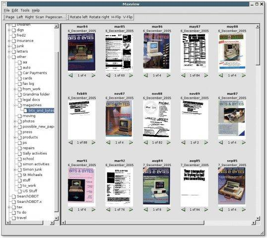
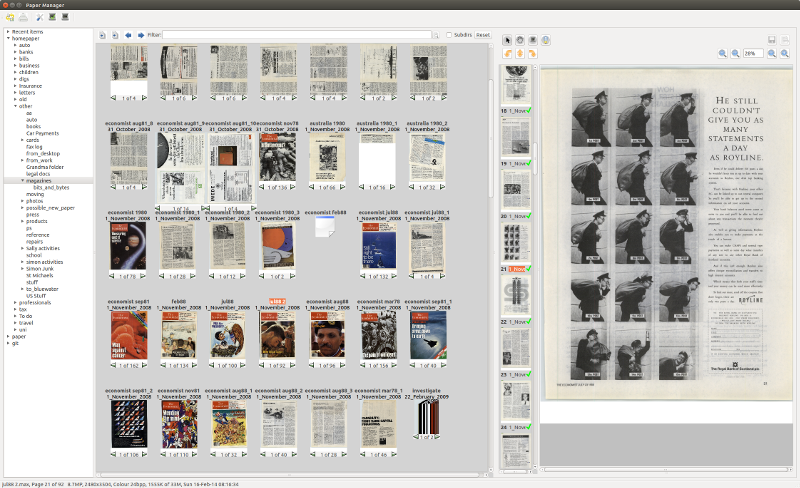

Introduction
============

Paperman is a viewer for image files such as PDF, JPEG and its own variant of
PaperPort's .max file format. It also includes a search server with a REST API
for querying paper repositories and a Flutter mobile app for browsing and
viewing documents on Android and iOS.

Features
--------

- Simple GUI based around stacks and pages
- View previews and browse through pages
- Move pages in and out of stacks
- Navigate through directories
- Move stacks between directories
- Print stacks and pages, including page annotations
- Full undo/redo
- Scanning support with presets
- PDF, JPEG and TIFF conversion
- OCR engine with full-text search
- Search server with REST API
- Mobile app with offline demo mode (see :doc:`app`)
- Email files as PDF via Gmail (see `Emailing files`_)

Emailing files
--------------

The Email menu (Ctrl+Shift+E for "Email as PDF") converts the selected
files to the chosen format, copies the resulting file to the clipboard
as a ``text/uri-list`` and opens Gmail's compose window in the default
browser.  Once the compose window is up, click in the message body and
press Ctrl+V to attach the file.

The clipboard step is the only path that lands an actual attachment in
Gmail: ``mailto:`` URLs cannot carry attachments per RFC 6068, so Gmail
ignores any attachment argument on the compose URL itself.  The same
flow works with other webmail clients (Outlook on the web, Fastmail)
that accept file paste into compose, and with desktop Chrome / Firefox
generally.

If more than one file is selected they are packed into a single zip
first, since most compose paste handlers only take one file.

Copying files
-------------

The Copy command (Ctrl+C) converts the selected files to PDF and puts
the result on the clipboard as a ``text/uri-list``, the same way the
Email menu does, but without opening a browser.  Paste it wherever a
file is wanted: a Gmail compose window (Ctrl+V attaches it), a file
manager, or a chat window.  As with email, more than one file is packed
into a single zip first.
