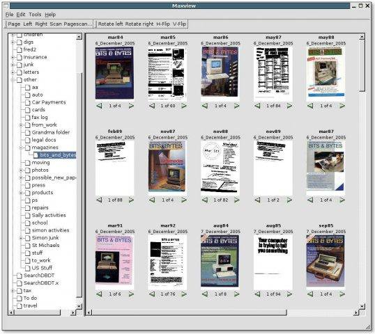
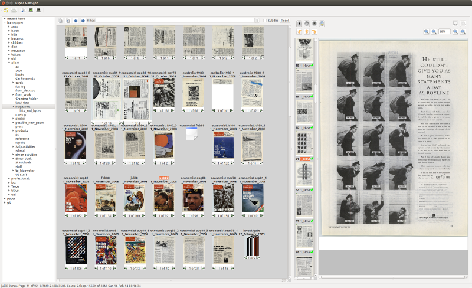

Introduction
============

Paperman is an electronic filing cabinet: it scans paper into stacks of
pages, and lets you view, arrange, annotate, print, search and send them.
It reads and writes PDF, JPEG and its own variant of PaperPort's .max file
format.

Paperman has three parts:

The desktop program
   for scanning, filing and working with papers, on Linux, Windows and
   macOS (see :doc:`install` and :doc:`scanning`)

The search server, ``paperman-server``
   which serves repositories over the network, with a REST API, so that
   they can be reached from elsewhere: the desktop program shows a
   server's repositories beside its own and can change them, and the
   apps browse them (see :doc:`server` and :doc:`api`)

The Android and iPhone app
   for finding and reading papers from a phone or tablet, from a
   server's repositories, with a full-text search and each document
   shown as a PDF (see :doc:`app`)

So papers can be scanned at a desk, kept on one machine running the
server, and found from anywhere.

Features
--------

- Simple GUI based around stacks and pages
- View previews and browse through pages
- Move pages in and out of stacks
- Navigate through directories
- Move stacks between directories
- Print stacks and pages, including page annotations
- Full undo/redo
- Scanning from sheet-fed scanners, fast, with presets (see :doc:`scanning`):

  - pages cut to the sheet, and straightened, by the scanner
  - pages without colour stored as grey or mono, while a page with a
    coloured mark or note on it stays in colour
  - blank pages found and left out
  - sheets fed sideways turned upright, and sheets longer than any paper
    size scanned whole
  - a misfeed or jam waits to be cleared, and loses no pages
  - scanning from the command line (see :doc:`cli`)

- PDF, JPEG and TIFF conversion
- Unfolding scanned booklets into their pages
- OCR with full-text search: scanned pages are read in the background
  (tesseract), each page's text is shown beside it, stacks can be found by
  the words on their pages, and the PDFs Paperman makes can be searched
  and their text copied (see `Reading the text of pages`_)
- Search server with REST API, whose repositories the desktop can show and
  change, with changes made elsewhere shown as they happen (see
  :doc:`server`)
- Android and iPhone app for browsing, searching and reading a server's
  repositories, with an offline demo mode (see :doc:`app`)
- Email files as PDF via Gmail (see `Emailing files`_)
- Linux, Windows (x64 and Arm) and macOS

Reading the text of pages
-------------------------

Once a scan is saved, Paperman reads the text of its pages in the
background with tesseract, which must be installed and on the ``PATH``.
Each page keeps its words, with where each one is, in the stack's
``.max`` file, so they go with the page when it is stacked, unstacked,
deleted or copied. The option "Read the text of scanned pages (OCR)" in
the scan settings turns this off, and the "Read text (OCR)" stack action
reads stacks scanned before, or with it off.

In the page view, the OCR pane shows the text of the page being shown.
Turning a page drops its text, which is then read again the right way up.

To find a stack by what is written on it, use Edit > Search, choose
"Text on the pages" and type some words: the stacks with all of them are
shown, best first, each turned to the page which matches best. The last
word may be the start of a word. Text which OCR put into a stack's OCR
annotation, as it did before pages kept their own words, and text typed
there, is found too, on the stack's first page. The index behind this is
kept in ``.paperindex`` at the top of the repository and is brought up to
date each time you search. When a new version of Paperman finds text
which an older one did not, it builds the index again the first time you
search, which can take a while in a large repository.

The PDFs Paperman makes, when duplicating, emailing or copying stacks,
have the words of each page which has been read as an invisible layer of
text, so a PDF viewer can search them and select and copy their text.

Emailing files
--------------

The Email menu (Ctrl+Shift+E for "Email as PDF") converts the selected
files to the chosen format, copies the resulting file to the clipboard
as a ``text/uri-list`` and opens Gmail's compose window in the default
browser.  Once the compose window is up, click in the message body and
press Ctrl+V to attach the file.

The clipboard step is the only path that lands an actual attachment in
Gmail: ``mailto:`` URLs cannot carry attachments per RFC 6068, so Gmail
ignores any attachment argument on the compose URL itself.  The same
flow works with other webmail clients (Outlook on the web, Fastmail)
that accept file paste into compose, and with desktop Chrome / Firefox
generally.

If more than one file is selected they are packed into a single zip
first, since most compose paste handlers only take one file.

Copying files
-------------

The Copy command (Ctrl+C) converts the selected files to PDF and puts
the result on the clipboard as a ``text/uri-list``, the same way the
Email menu does, but without opening a browser.  Paste it wherever a
file is wanted: a Gmail compose window (Ctrl+V attaches it), a file
manager, or a chat window.  As with email, more than one file is packed
into a single zip first.
